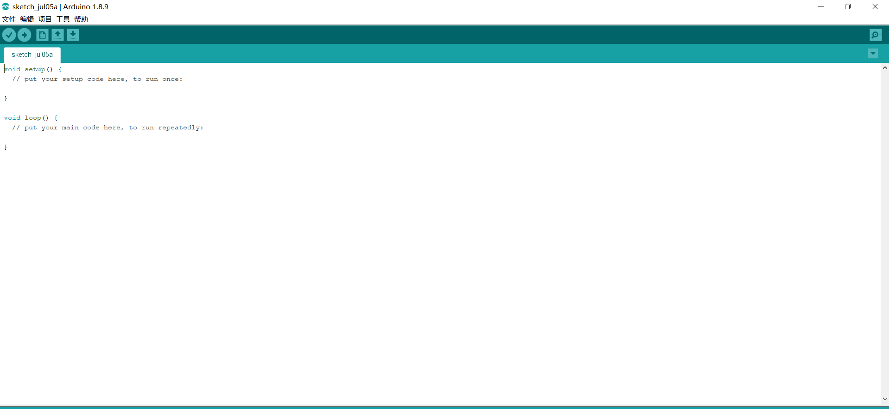
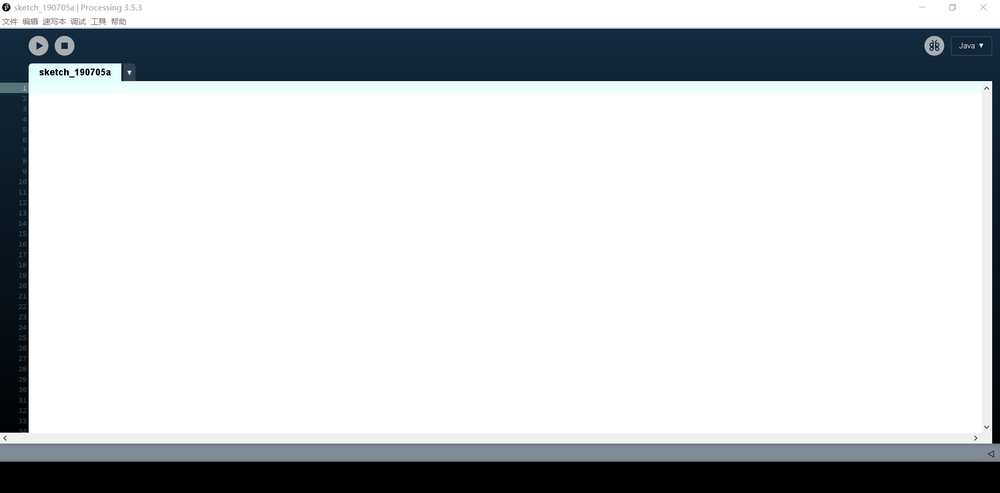
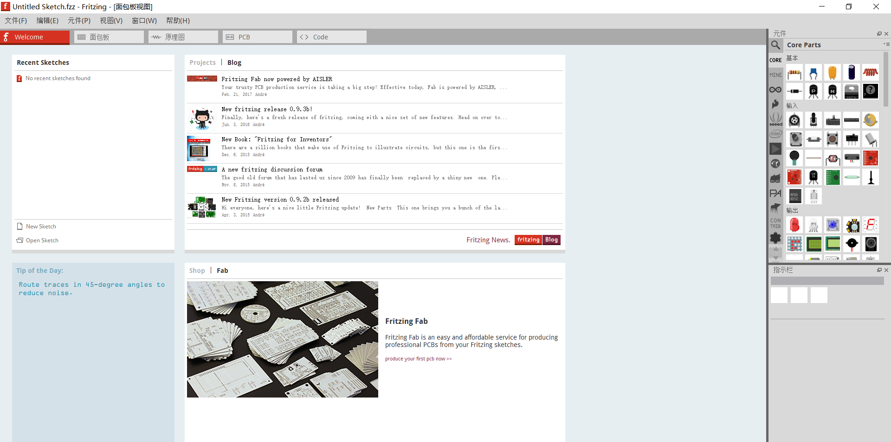
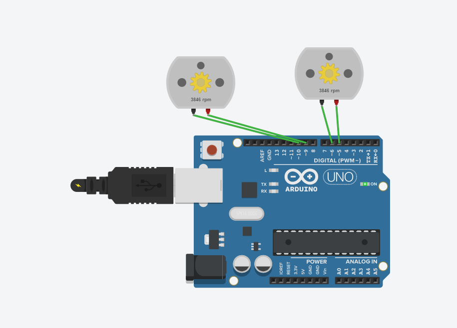
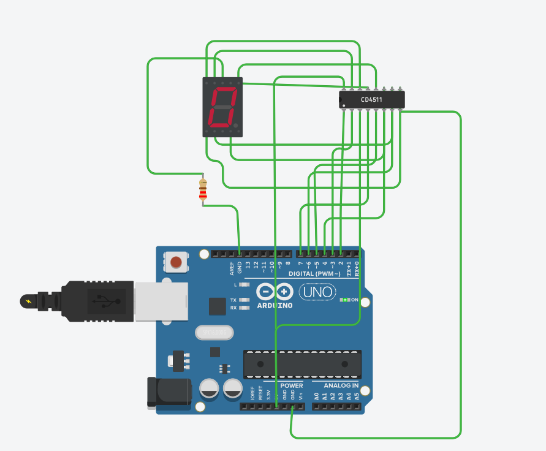
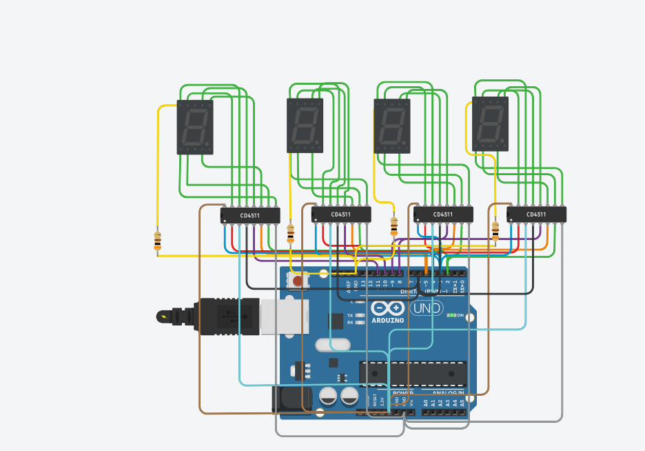

# ttbit1的开源硬件作业

## 第一天

#### 学习内容

-  为什么要学习开源硬件
- 如何学习开源硬件
- 三个软件
   
   arduino
  
  
  processing
  
  
  fritzing
  
  
- 几个常用网站
  [arduino网址](https://arduino.cc)
  
  [fritzing网址](https://fritzing.org)
   
  [processing网址](https://processing.org)
## 第二天
  arduino编程
  
  [摩尔斯电码的输出](https://github.com/ttbit1/Morse/blob/master/%E4%B8%83%E6%9C%88%E4%B8%89%E6%97%A5%E5%AE%B6%E5%BA%AD%E4%BD%9C%E4%B8%9A%E2%80%94%E2%80%94%E6%91%A9%E5%B0%94%E6%96%AF%E7%A0%81/Morse.ino)
  
   
## 第三天
1.课堂作业-小车设计
  小车电路图

 [小车的设置](https://github.com/ttbit1/Morse/blob/master/%E4%B8%83%E6%9C%88%E5%9B%9B%E6%97%A5%E8%AF%BE%E5%A0%82%E4%BD%9C%E4%B8%9A/neat_gaaris1.ino)
 
 2.家庭作业——七段数码管的显示
   七段数码管显示电路图
   
   [七段数码管显示的设置](https://github.com/ttbit1/Morse/blob/master/%E4%B8%83%E6%9C%88%E5%9B%9B%E6%97%A5%E5%AE%B6%E5%BA%AD%E4%BD%9C%E4%B8%9A%E2%80%94%E2%80%94%E6%95%B0%E7%A0%81%E7%AE%A1%E7%9A%84%E6%95%B0%E5%AD%97%E6%98%BE%E7%A4%BA/terrific_maimu_fulffy1.ino)
 
## 第四天
   1.[摩尔斯码的实现](https://github.com/ttbit1/Morse/blob/master/%E4%B8%83%E6%9C%88%E4%B8%89%E6%97%A5%E5%AE%B6%E5%BA%AD%E4%BD%9C%E4%B8%9A%E2%80%94%E2%80%94%E6%91%A9%E5%B0%94%E6%96%AF%E7%A0%81/Morse.ino)
  
  2.多个数码管的显示电路图
   

